# What is Adaptly?

Adaptly is an AI-powered adaptive UI library that lets your React applications understand natural language and automatically rearrange components based on user intent. With a simple `⌘K` command, users can describe what they want to see, and Adaptly uses Large Language Models (LLMs) to dynamically recompose your interface using your existing components.

## 🎯 The Problem Adaptly Solves

Traditional dashboards and applications require users to:

- Navigate through complex menus to find features
- Manually configure layouts and filters
- Learn specific UI patterns and workflows
- Constantly switch between different views

**Adaptly changes this by letting users simply say what they want:**

> "Show me sales data for this quarter"  
> "Create a dashboard with revenue metrics"  
> "Add charts and filter by this week"

The AI understands the intent and automatically:

- Selects the right components from your registry
- Arranges them in an optimal layout
- Configures props and filters
- Updates the UI in real-time

## 🚀 Key Features

- **🤖 Multi-LLM Support:**  
  Choose from Google Gemini, OpenAI GPT-4, or Anthropic Claude with seamless provider switching at runtime.

- **💾 Persistent Storage:**  
  Automatically saves and restores UI state across sessions with version control and migration support.

- **📋 Component Registry:**  
  Define your components in `adaptly.json` with descriptions, props, and use cases for AI understanding.

- **⌨️ Built-in Command Interface:**  
  Press `⌘K` to open the command bar with AI suggestions and natural language input.

- **🔍 Smart Data Filtering:**  
  LLM can filter and configure existing data without passing new data - perfect for security and performance.

- **🔧 TypeScript First:**  
  Full type safety with comprehensive interfaces and IntelliSense support.

- **⚡ Next.js Ready:**  
  Seamless integration with App Router and React 19+ support.

## 🏗️ How It Works

```mermaid
graph TD
    A[User presses ⌘K] --> B[Natural language input]
    B --> C[LLM processes request]
    C --> D[Analyzes available components]
    D --> E[Generates layout plan]
    E --> F[Validates components]
    F --> G[Updates UI]
    G --> H[Auto-saves to storage]
```



### 1. **Component Registry**

You define your components in `adaptly.json` with descriptions, props, and use cases:

```json
{
  "version": "1.0.0",
  "components": {
    "MetricCard": {
      "description": "Display key performance indicators with values, trends, and progress bars",
      "props": {
        "title": { "type": "string", "required": true },
        "value": { "type": "string", "required": true },
        "change": { "type": "string", "required": false }
      },
      "useCases": ["revenue tracking", "user metrics", "KPI display"],
      "space": { "min": [2, 1], "max": [3, 2], "preferred": [2, 1] }
    }
  }
}
```

### 2. **AI Processing**

When a user says "Show me revenue metrics", the LLM:

- Analyzes the request against your component registry
- Selects appropriate components (MetricCard)
- Generates props and layout configuration
- Returns a structured plan

### 3. **Dynamic Rendering**

Adaptly renders the components using your actual React components:

```tsx
<AdaptlyProvider
  apiKey="your-api-key"
  provider="google"
  model="gemini-2.0-flash-exp"
  components={{ MetricCard, SalesChart, TeamMembers }}
  adaptlyConfig={adaptlyConfig}
  enableStorage={true}
/>
```

### 4. **Persistent State**

All changes are automatically saved to localStorage and restored on page reload.

## 🎯 Real-World Use Cases

### Dashboard Applications

- **Analytics Dashboards**: "Show me user engagement metrics for this month"
- **Business Intelligence**: "Create a sales performance dashboard"
- **Monitoring Systems**: "Display server health and alerts"

### Content Management

- **Admin Panels**: "Show me recent user registrations and activity"
- **E-commerce**: "Display order analytics and inventory status"
- **Project Management**: "Create a team productivity overview"

### Data Visualization

- **Financial Reports**: "Show me quarterly revenue and expenses"
- **Marketing Analytics**: "Display campaign performance metrics"
- **Operational Dashboards**: "Create a system status overview"

## 🚀 Quick Start

Ready to get started? Follow our [Quick Start Guide](quick-start) to set up Adaptly in 5 minutes with a working example.

### For Beginners

- [Quick Start Guide](quick-start) - Get up and running in 5 minutes
- [Component Registry Guide](component-registry) - Learn to configure your components
- [LLM Providers Guide](llm-providers) - Set up AI providers

### For Advanced Users

- [Advanced Features Guide](advanced-features) - Custom loaders, validation, and hooks
- [Storage Service Guide](storage-service) - Persistent state management
- [API Reference](api/core-components) - Complete component documentation

## 🔗 Example Applications

See Adaptly in action with our complete demo application:

- **[Adaptly Demo](https://github.com/gauravfs-14/adaptly/tree/main/examples/adaptly-demo)** - Full-featured dashboard with 10+ components
- **[Component Examples](https://github.com/gauravfs-14/adaptly/tree/main/examples/adaptly-demo/src/components)** - Real React components you can use
- **[Configuration Examples](https://github.com/gauravfs-14/adaptly/tree/main/examples/adaptly-demo/adaptly.json)** - Complete `adaptly.json` setup

## 🤝 Community & Support

- **GitHub Issues**: [Report bugs and request features](https://github.com/gauravfs-14/adaptly/issues)
- **Discussions**: [Ask questions and share ideas](https://github.com/gauravfs-14/adaptly/discussions)
- **NPM Package**: [Install from npm](https://www.npmjs.com/package/adaptly)

## 📄 License

Adaptly is open source and available under the [MIT License](https://github.com/gauravfs-14/adaptly/blob/main/LICENSE).

---

**Ready to build intelligent, adaptive UIs?** Start with our [Quick Start Guide](quick-start) and have Adaptly running in your app in just 5 minutes!
